# Overview
The User Management System is a robust, scalable application designed to streamline user management processes with advanced features and best practices. Developed as part of an open-source project led by Professor Keith Williams at NJIT, this project serves as a bridge between professional software development practices and student learning experiences.            

The system implements core functionalities for managing user data, enforcing security policies, and providing administrators with tools to efficiently search, filter, and validate user records. It is designed to be extensible, following modern development principles like CI/CD automation, secure authentication, and comprehensive testing.            

## Technical Stack        
- Backend Framework: FastAPI (Python)       
- Database: PostgreSQL        
- Containerization: Docker         
- CI/CD: GitHub Actions         
- Testing Tools: Pytest         
- Authentication: JWT (JSON Web Token)          
- Code Style: PEP8-compliant with strong typing and linting       

## Project Goals       
The primary goal of this project is to implement a production-ready User Management System that adheres to best practices for security, scalability, and maintainability. It focuses on empowering administrators with tools to manage users efficiently while providing a secure and user-friendly experience for end users.         

The Search and Filtering Capabilities feature highlights the project's ability to combine advanced search functionality with dynamic filters, pagination, and rigorous testing for performance optimization.       

## Learning Outcomes           
Hands-on experience with FastAPI and modern Python development.
Practical knowledge of CI/CD pipelines and Dockerization for seamless deployment.         
Advanced understanding of data validation, password security, and robust error handling.           
Implementation of real-world testing scenarios, including edge case handling and comprehensive coverage.           

## Project Status        
This project successfully delivered the following milestones:        

1. Resolution of critical issues related to security, validation, and system behavior.         
2. Implementation of advanced features like search, filtering, and role-based management.          
3. Full test coverage across layers with detailed reporting.         

## How to Get Started         
- Clone the repository:

```python 
git clone https://github.com/MahrokhJozedaemi2016/final_user_management.git
cd final_user_management
```
- Run the project with Docker:         
```python
docker-compose up --build
```   

## Reflection file:      
[**Project Reflection**](Reflection.md)            
       

## Docker Repository and Image Overview        
The Docker image for this project is hosted on Docker Hub.          

**Docker Hub Repository** 
[**View the Repository on Docker Hub**](https://hub.docker.com/r/mahrokhjozedaemi/final_user_management/tags)         

**Image Overview**  
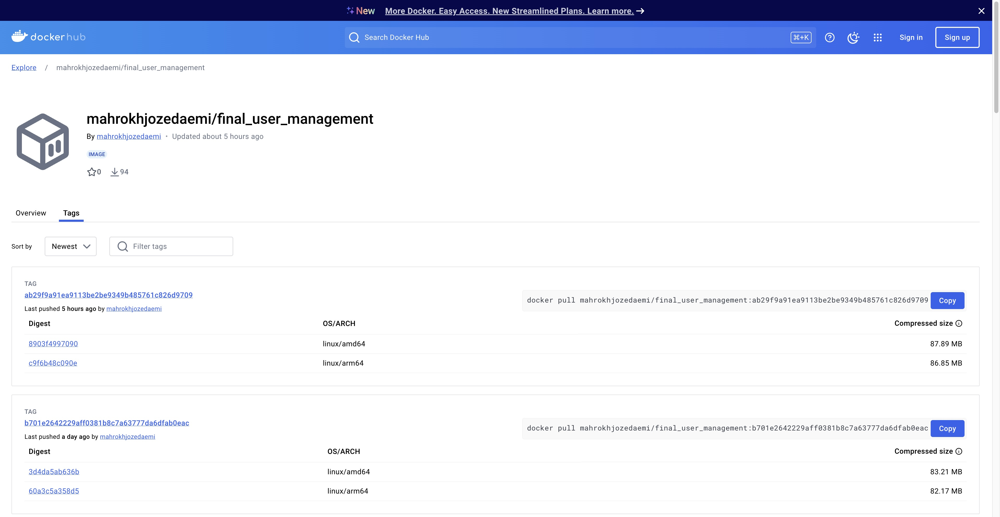          


# link to issues:             
## Issue 1: Fix Docker Build Error Related to libc-bin Version Constraint:          
[Issue 1: Fix Docker Build Error](https://github.com/MahrokhJozedaemi2016/final_user_management/issues/1)        

## Issue 2: CI/CD Pipeline Update for GitHub Actions:      
[CI/CD Pipeline Update for GitHub Actions](https://github.com/MahrokhJozedaemi2016/final_user_management/issues/3)        

## Issue 3:  Implement Robust Username Generation and Validation for Enhanced User Management             
[Implement Robust Username Generation and Validation for Enhanced User Management](https://github.com/MahrokhJozedaemi2016/final_user_management/issues/7)         

## Issue 4 : Password Validation and Security Enhancements     
[Password Validation and Security Enhancements](https://github.com/MahrokhJozedaemi2016/final_user_management/issues/11)       

## Issue 5: User Uniqueness Validation      
[User Uniqueness Validation](https://github.com/MahrokhJozedaemi2016/final_user_management/issues/13)       

## Issue 6:  Automatically Assign Admin Role to First Registered User     
[Automatically Assign Admin Role to First Registered User](https://github.com/MahrokhJozedaemi2016/final_user_management/issues/15)        

## Issue 7: User Bio Update Validation and Error Handling        
[User Bio Update Validation and Error Handling](https://github.com/MahrokhJozedaemi2016/final_user_management/issues/17)      

## Issue 8: Ensure Admin User Exists and Streamline /login Authentication Logic           
 [Ensure Admin User Exists and Streamline /login Authentication Logic](https://github.com/MahrokhJozedaemi2016/final_user_management/issues/19)         

 ## Feature: Search and Filtering Capabilities for User Management       
[Search and Filtering Capabilities for User Management](https://github.com/MahrokhJozedaemi2016/final_user_management/issues/8)      

## link to Search and Filtering Capabilities branch:        
[Search and Filtering Capabilities For User Management](https://github.com/MahrokhJozedaemi2016/final_user_management/tree/feature/advanced-search-and-filter)      

## link to Fix Docker Build Error Related to libc-bin Version Constraint branch:       
[Fix Docker Build Error Related to libc-bin Version Constraint](https://github.com/MahrokhJozedaemi2016/final_user_management/tree/fix-docker-compose-build-error)       

## Link to CI/CD Pipeline Update for GitHub Actions branch             
[CI/CD Pipeline Update for GitHub Actions](https://github.com/MahrokhJozedaemi2016/final_user_management/tree/edit-production-yml-for-ci-cd)      

## link to Implement Robust Username Generation and Validation for Enhanced User Management branch             
[Implement Robust Username Generation and Validation for Enhanced User Management](https://github.com/MahrokhJozedaemi2016/final_user_management/tree/User-Validation)        

## Link to Password Validation and Security Enhancements branch          
[Password Validation and Security Enhancements](https://github.com/MahrokhJozedaemi2016/final_user_management/tree/Password-validation)

## Link to User Uniqueness Validation branch           
[User Uniqueness Validation](https://github.com/MahrokhJozedaemi2016/final_user_management/tree/ensure-username-uniqueness)         

## Link to Automatically Assign Admin Role to First Registered User branch             
[Automatically Assign Admin Role to First Registered User](https://github.com/MahrokhJozedaemi2016/final_user_management/tree/feature-first-user-admin)        

## Link User Bio Update Validation and Error Handling branch      
[User Bio Update Validation and Error Handling](https://github.com/MahrokhJozedaemi2016/final_user_management/tree/user-profile-updates)         

## Link to Ensure Admin User Exists and Streamline /login Authentication Logic branch      
[Ensure Admin User Exists and Streamline /login Authentication Logic](https://github.com/MahrokhJozedaemi2016/final_user_management/tree/fix/admin-login-swagger)       

## Tests for Search and Filtering Capabilities for User Management    
## API Layer Tests    
[API Layer Tests](https://github.com/MahrokhJozedaemi2016/final_user_management/blob/main/tests/test_api/test_user_search_and_filtering.py): Tests related to API endpoint functionality.           
## Service Layer Tests       
[Service Layer Tests](https://github.com/MahrokhJozedaemi2016/final_user_management/blob/main/tests/test_services/test_user_search_and_filtering_service.py): Tests the service layer logic for filtering and searching users.         
## Pagination Utility Tests     
[Pagination Tests](https://github.com/MahrokhJozedaemi2016/final_user_management/blob/main/tests/test_utils/test_user_search_and_filtering_pagination.py): Validates pagination logic for user search results.         

# ISSUE: Fix Docker Build Error Related to libc-bin Version Constraint    
## Description:    
The Docker Compose build process failed due to a version constraint on the libc-bin package in the Dockerfile. Specifically, the issue occurred because the specified version of libc-bin conflicted with the system requirements, causing a downgrade without using the --allow-downgrades flag. This led to build errors when running:         
```python
docker compose up --build
```
## Root Cause:         
- The Dockerfile included a hardcoded version constraint for libc-bin (2.36-9+deb12u7).         
- Docker's package management system could not reconcile the specific version during installation.           
- Running without --allow-downgrades caused the build to fail.        

## Key Features of the Fix:          
1. Removal of Specific libc-bin Version Constraint         
- The hardcoded version libc-bin=2.36-9+deb12u7 was removed to allow the latest version of libc-bin to install seamlessly.              

2. Consolidation of Installation Commands         
- Installation of system dependencies and cleanup steps were optimized into a single RUN command, improving efficiency and readability.    

3. Improved Dockerfile Comments            
- Updated comments to ensure clarity about the purpose of each section, aligning with best practices.           

## Benifits:       
- Successful Build: The Docker Compose build process now completes without errors.             
- Future Compatibility: Avoiding a specific version ensures the latest compatible libc-bin version is installed, reducing maintenance overhead.       
- Efficiency: Combining installation commands reduces the number of layers in the Docker image, improving performance and image size.        

## Expected Outcome:      
Users can run the following command to build and run the application successfully:      
```python
docker compose up --build
```
## output of Pytest:      
            

## Files Updated:      
1. Dockerfile         
- Removed the specific version constraint for libc-bin.            
- Combined installation commands for system dependencies and cleanup.          
- Improved inline comments to explain the changes.           

# ISSUE:CI/CD Pipeline Update for GitHub Actions             
## Description:        
This update fixes the GitHub Actions CI/CD pipeline to build and push Docker images to the correct DockerHub repository: mahrokhjozedaemi/final_user_management. It adds multi-platform support (linux/amd64 and linux/arm64) and integrates Trivy for vulnerability scanning with caching to ensure efficient and secure deployments.          

## Enhancements          
1. DockerHub Repository Update
- Updated Docker image repository name to match my DockerHub account:     
mahrokhjozedaemi/final_user_management.          
- The tags and image references now correctly use this repository.      

2. Multi-Platform Build Support             
- Enabled support for linux/amd64 and linux/arm64 platforms using the docker/build-push-action.            
- Ensures the Docker image can run across multiple architectures seamlessly.             

3. Optimized Docker Image Scanning             
- Integrated Trivy vulnerability scanner into the GitHub Actions workflow.          
- Custom installation of Trivy allows greater flexibility, including:
   - Efficient database caching to speed up scans.      
   - Scans configured to identify CRITICAL and HIGH severity vulnerabilities.          
- Ensures the pipeline fails if security vulnerabilities are detected.      
4. Improved Workflow Efficiency              
- Combined installation and runtime commands for optimized performance.          
- Added caching for Trivy databases, reducing scan execution time.       
- Cleaned up redundant configurations for clarity and maintainability.        

## Benefits:       
- Correct Repository Configuration: Docker images are now built and pushed to the correct repository:       
mahrokhjozedaemi/final_user_management.          
- Multi-Platform Compatibility: Supports amd64 and arm64 architectures, increasing image portability.           
- Improved Security: Ensures Docker images are scanned for critical vulnerabilities before deployment.            
- Faster Pipelines: Optimized build, caching, and scanning reduce the overall CI/CD pipeline runtime             

## Expected Outcome        
The GitHub Actions CI/CD pipeline will:
1. Build and push Docker images to the repository:          
mahrokhjozedaemi/final_user_management.
2. Target both linux/amd64 and linux/arm64 platforms.           
3. Scan Docker images for CRITICAL and HIGH vulnerabilities using Trivy.            
4. Fail the workflow if vulnerabilities are detected, ensuring secure production deployments.             

## Files Updated           
- .github/workflows/production.yml          
- Updated DockerHub repository name.           
- Enabled multi-platform support.            
- Added Trivy vulnerability scanning with caching.             

# ISSUE: Implement Robust Username Generation and Validation for Enhanced User Management            

## Description:
This section of the project implements robust username management features designed to enhance user experience and ensure data integrity. The implementation supports the automatic generation of unique, URL-safe nicknames for users during creation while allowing users to change their nicknames with validation. It enforces strict uniqueness and format constraints, ensuring compatibility with public-facing identifiers. This functionality improves user anonymity and privacy by assigning meaningful, anonymous nicknames based on a combination of words and numbers.            

## Key Features:
1. Username Generation:          

- Randomly generate nicknames upon user creation.              
- Use a combination of nouns, verbs, and a numeric suffix to ensure meaningful and diverse names.                  

2. Nickname Uniqueness:              
- Validate that no two users share the same nickname.               
- Handle duplicate nickname conflicts during both user creation and updates.
                    
3. URL-Safe Identifier:                  
- Ensure that nicknames are URL-safe, allowing them to be used in public contexts without encoding issues.                      
- Only allow alphanumeric characters, underscores, and hyphens in nicknames.
                          
4. User-Controlled Updates:               
- Allow users to update their nicknames, ensuring the new nickname is both valid and unique.           

5. Privacy and Anonymity:                        
- Assign anonymous nicknames by default to protect user identities.          
- Maintain privacy by validating nicknames against strict rules.          

6. Testing and Verification:                       
- The system includes comprehensive tests to ensure correctness, with plans for additional tests to cover edge cases and rare scenarios.          

## Expected Outcome                
- Users will always have unique nicknames, either system-generated or user-updated.                        
- Nicknames will be compliant with URL-safety standards, ensuring seamless usage in public links.                     
- Conflicts arising from duplicate nicknames during creation or updates will be handled gracefully.                    
- User privacy and anonymity will be safeguarded through anonymous nickname assignments.                       

## Files Update for this issue:                       
The implementation of the nickname management and validation features involved updates to multiple components of the project, reflecting the complexity of the requirements. Below is a detailed explanation of the resolution steps and the specific changes made to each relevant file:

1. app/services/user_service.py                        
Changes Made:                   
Nickname Validation During Creation:                     
- Updated the create method to validate nicknames against database records.       
- Used the generate_nickname() function to generate random nicknames and ensure uniqueness before assigning them to users.            
- Integrated the validate_url_safe_username() function to check the format of nicknames.                      
- Handled duplicate nickname errors gracefully with proper logging and error messages.                       

2. Nickname Validation During Updates:               
- Updated the update method to enforce uniqueness for nicknames during updates.                                 
- Validated that nicknames meet URL-safety standards before saving changes.       

Purpose: Ensure that all nicknames are unique, valid, and compliant with URL-safe standards during user creation and updates.              

3. tests/test_api/test_users_api.py            
Changes Made:             
Test for Duplicate Nickname Creation:
- Added test_create_user_duplicate_nickname to ensure that creating a user with a duplicate nickname fails.                 
- Mocked external email service to focus on nickname validation logic.      

Test for Duplicate Nickname Updates:                          
- Added test_update_user_duplicate_nickname to validate that nickname updates with duplicates are rejected.               
- Used the test client to simulate API calls for creation and updates.          
Purpose: Verify that the API layer correctly handles nickname uniqueness and format validation.            

4. tests/test_services/test_user_service.py              
Changes Made:             
Test for Nickname Creation:           
- Added tests to ensure that generated nicknames are unique and comply with URL-safety rules.             
- Mocked email service to isolate the nickname generation and validation logic.                

Test for Duplicate Nickname Handling:               
- Added test_create_user_duplicate_nickname and test_update_user_duplicate_nickname to validate service-layer logic for handling duplicates.                 

Purpose: Test the internal service logic to ensure correctness and coverage of nickname generation and validation features.                  

5. app/utils/nickname_gen.py                
Changes Made:                  
- Implemented the generate_nickname() function to generate random combinations of nouns, verbs, and numbers.                
- Added utility functions to validate the format and uniqueness of nicknames.                  

- Purpose: Provide a reusable utility to create meaningful and unique nicknames while adhering to project constraints.            

6. app/utils/validators.py          
Changes Made:           
- Added the validate_url_safe_username() function to enforce URL-safe standards for nicknames.               

Purpose: Ensure that nicknames can safely be used as public-facing identifiers in URLs without encoding issues.            

7. tests/conftest.py              
Changes Made:              
- Added new test fixtures to create mock users with unique nicknames for testing.                
- Introduced an admin_user and manager_user fixture for role-based testing of API endpoints.                

Purpose: Facilitate testing of nickname uniqueness and validation in both API and service layers.               

8. app/models/user_model.py            
Changes Made:           
- Updated the User model to enforce uniqueness constraints on the nickname field at the database level.             

Purpose: Add an additional layer of protection against duplicate nicknames, even in concurrent user creation scenarios.             

## Test
Overview
This section outlines the tests implemented to verify the functionalities related to Username Generation and Validation. These tests ensure that the following features are correctly implemented and functional:             

- Username Generation: Automatically generates a random, unique username combining nouns, verbs, and numbers.            
- Uniqueness: Validates that usernames are unique during creation and updates.              
- Validation: Ensures usernames are URL-safe and adhere to format constraints.               
- User Privacy and Anonymity: Keeps usernames secure and private.           
- Edge Case Handling: Handles invalid data gracefully.              

## Pytest        

1. API Tests
File: tests/test_api/test_users_api.py          

Key Tests:          
- test_create_user_duplicate_nickname: Verifies that creating a user with a duplicate nickname fails.             
- test_update_user_duplicate_nickname: Ensures that updating a user to have a duplicate nickname fails.             
- test_create_user_invalid_data: Tests that invalid data (e.g., missing required fields) is handled properly.             


2. Service Tests              
File: tests/test_services/test_user_service.py          

Key Tests:             
- test_create_user_with_valid_data: Ensures valid user data creates a user successfully.                  
- test_create_user_duplicate_email: Confirms duplicate email detection and rejection.               
- test_update_user_duplicate_nickname: Validates that updating to a duplicate nickname is disallowed.                      
- test_update_user_invalid_data: Checks handling of invalid user update data.                     

### Test Results for API Tests
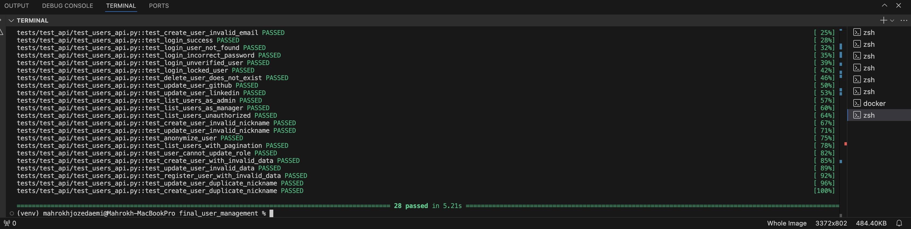

### Test Results for User Service Tests
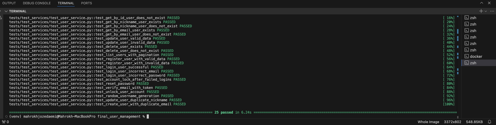


# ISSUE: Password Validation and Security Enhancements     
## Enhancement:                  
To ensure the highest level of security for user accounts, we have introduced robust password validation mechanisms. These updates are designed to align with industry standards for secure password practices, minimizing the risk of unauthorized access and protecting user data.          

## Key Features of Password Validation           
1. Minimum Length Requirement              
Passwords must be sufficiently long to enhance resistance to brute-force attacks. A password must contain at least 8 characters to be accepted.             
2. Complexity Requirements          
To ensure passwords are not easily guessable, they must include a mix of different character types:           
- Uppercase Letters: At least one uppercase letter (e.g., A-Z) to strengthen the password.            
- Lowercase Letters: At least one lowercase letter (e.g., a-z) to improve complexity.             
- Numbers: At least one numeric character (e.g., 0-9) is required.           
- Special Characters: To add further complexity, the password must include at least one special character (e.g., !@#$%^&*()_+-=<>?).             
3. Restrictions on Spaces               
Passwords should not contain whitespace characters to maintain consistency and avoid unexpected formatting issues during user input.                
4. Secure Password Storage                
Passwords are securely hashed before being stored in the database using modern cryptographic algorithms. This ensures that even in the unlikely event of a data breach, user passwords remain protected.           
5. Clear Error Messaging              
Validation errors provide users with actionable feedback, ensuring clarity while maintaining security best practices.      

## Benefits of Enhanced Password Validation          
- Improved User Security: The updated validation rules significantly reduce the risk of weak passwords, enhancing the security of user accounts.                 
- Compliance with Best Practices: By requiring a mix of character types and enforcing a minimum length, this approach aligns with established security standards.                
- Anonymized and Protected Data: Proper password hashing ensures that passwords are never stored in plain text, protecting user privacy and data integrity.       

## Expected Outcomes             
These password validation enhancements ensure that all users create strong, secure passwords, mitigating risks associated with weak or compromised credentials. In addition to protecting user accounts, the system provides clear guidelines and helpful error messages, making it user-friendly while maintaining a high level of security.              

All tests related to these features are included and verified to ensure compliance with the updated validation rules.                

## Files Updated for Password Validation Implementation        
To introduce robust password validation mechanisms and enhance user account security, several files were updated in the project. Here’s a summary of the changes:          

1. User Schemas           
Enhanced to include validation rules that enforce minimum password length and complexity requirements. These updates ensure that all user input is thoroughly validated before reaching the database.         

2. User Service          
Modified to handle password validation during user creation and updates. The service ensures proper feedback is provided for invalid passwords and implements secure password hashing before storage.        

3. ecurity Utilities                
Updated to define the core password validation logic. This includes the criteria for password complexity and hashing algorithms for secure storage.                   

4. Configuration File                
Introduced configurable password validation parameters, such as minimum length and complexity requirements, allowing for easier updates and adjustments in the future.                   

5. Test Suite                          
Enhanced to include new test cases that validate the updated password rules. These tests ensure the functionality works as expected under various scenarios, including invalid and valid password inputs.

## Pytest    


# ISSUE:User Uniqueness Validation         
## Enhancement:         
In modern systems, user uniqueness is a cornerstone of both security and usability. This enhancement ensures that users cannot share the same identifiers, such as nicknames or email addresses, providing a more secure, reliable, and seamless experience across the platform.           

## Key Features of User Uniqueness         
This enhancement introduces critical mechanisms to enforce user uniqueness in the system:        

1. Nickname Uniqueness:           
- Validates that each user has a unique nickname during both account creation and updates.         
- Implements a validation layer at the service level to query existing nicknames in the database.        
- Ensures nicknames meet formatting rules while being distinct.          

2. Email Address Uniqueness:            
- Guarantees that every email address is unique and associated with only one user.           
- Prevents duplicate registrations using the same email for multiple accounts.           

3. Error Handling and Messaging:           
- Provides clear, meaningful error messages when a duplicate nickname or email is encountered.       
- Ensures smooth communication between the client and server regarding validation issues.           

## Benefits of User Uniqueness          
The addition of user uniqueness validation delivers several benefits to the platform:            

1. Improved User Experience:             
- Avoids confusion or conflicts caused by duplicate identifiers.              
- Streamlines user interactions by ensuring that all nicknames and emails are distinct.             
- Prevents frustration during registration or profile updates by clearly communicating issues.          

2. Enhanced Security:            
- Eliminates risks of impersonation or unauthorized duplication of accounts.         
- Enforces stricter validation at multiple levels, including schemas and service layers.          

3. Data Integrity:                 
- Prevents inconsistencies in the database caused by duplicate entries.            
- Facilitates faster and more efficient database querying, as unique constraints optimize search operations.                  

4. Scalability:             
- Prepares the system for handling a growing number of users by enforcing strict uniqueness constraints.              
- Avoids bottlenecks in user authentication or management by maintaining clean and distinct data records.             

## Expected Outcome          
The implementation of user uniqueness validation ensures that:          

- Account Creation: Users cannot create an account with a nickname or email already registered in the system. Such attempts will result in a 400 Bad Request error with a detailed message explaining the issue.            
- Account Updates: Users cannot update their profile to use a nickname or email already in use by another account.                   
- Error Clarity: Validation errors are communicated through precise and user-friendly error messages, improving the overall user experience.         
Additionally, these improvements enhance the system’s ability to scale and integrate with other components or services securely and effectively.        

## Files Updated for User Uniqueness          
To implement and test this feature, the following files were updated and enhanced:        

1. Application Layer:          
- app/services/user_service.py:         

  - Added methods is_nickname_unique and is_email_unique to validate uniqueness in the database.         
  - Ensured these methods integrate seamlessly with existing account creation and update functionalities.           

- app/routers/user_routes.py:             
   - Integrated uniqueness checks into the create_user and update_user endpoints.            
   - Ensured API routes properly handle validation errors and communicate these errors to clients.        

2. Schema Layer:               
- app/schemas/user_schemas.py:      
  - Updated validation rules for nicknames and email addresses.        
  - Included constraints for unique identifiers and formatted error messages for better communication.       

3. Testing Layer:           
- tests/test_services/test_user_service.py:         
  - Added unit tests for is_nickname_unique and is_email_unique methods.         
 - Verified service-layer logic handles various scenarios, such as duplicates and valid unique entries.           

- tests/test_routes/test_user_routes.py:
  - Ensured endpoints return appropriate HTTP status codes and error messages for duplicate nicknames and emails.         
  - Tested both positive (valid data) and negative (duplicate or invalid data) scenarios.     

- tests/test_schemas/test_user_schemas.py:        
  - Verified schema validation prevents duplicate nicknames and email addresses.       
  - Included tests for proper error messages and invalid formatting.       

## Summary
This enhancement is a pivotal step forward in ensuring the robustness and reliability of our user management system. By enforcing strict uniqueness constraints at multiple levels, this feature delivers a secure, scalable, and user-friendly experience.         
For more details, review the specific files and tests updated as part of this enhancement.        

## Pytest:      
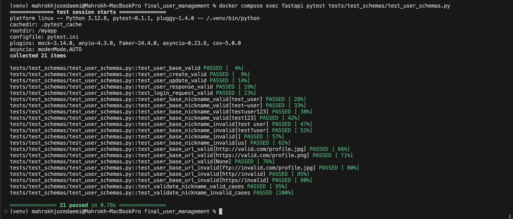


# ISSUE: Automatically Assign Admin Role to First Registered User        
## Enhancement:        
This enhancement ensures that the first user to register in the application is automatically assigned the ADMIN role. This functionality streamlines the initialization process by eliminating the need for manual configuration or updates to grant admin privileges for the first user.           

## Key Features of This Issue         
1. Automatic Role Assignment: The first user created in the system is assigned the ADMIN role by default, while all subsequent users retain the AUTHENTICATED role.              
2. Database Integrity: Ensures that roles are correctly assigned and persisted in the database with no manual intervention.          
3. Customizable Roles: Utilizes existing role definitions (UserRole) to handle both ADMIN and AUTHENTICATED roles seamlessly.        
4. Backward Compatibility: Maintains existing functionality for user creation, allowing customization and additional roles in the future.           

## Benefits:       
1. Simplified Setup: Reduces the manual steps needed during the initial configuration of the application by automatically assigning the administrator role.          
2. Secure Role Management: Ensures the first user always has the required administrative privileges, improving role integrity.          
3. Improved Developer Experience: Offers clarity and consistency when managing user roles during the development and testing phases.            
4. Ease of Use: For end-users and administrators, the setup is straightforward, reducing the chance of misconfiguration.           

## Expected Outcome       
1. Upon registering the first user, the application will automatically assign the ADMIN role to that user.         
2. All subsequent users will have the default role AUTHENTICATED, unless explicitly updated later.          
3. Role assignment logic is encapsulated within the UserService.create method, ensuring consistent behavior across all user creation pathways.      
4. Updated unit tests validate this behavior, guaranteeing that the logic works as expected during all edge cases.             

## Files Updated for Implementing This Issue          
1. user_service.py           
- Added logic in the UserService.create method to check if the user is the first in the database using the is_first_user method.          
- Updated role assignment logic to assign ADMIN to the first user.          
2. user_model.py          
- Ensured the role column uses an Enum to define roles (ADMIN and AUTHENTICATED) with a default value of AUTHENTICATED.             
3. test_user_service.py          
- Added/Updated tests to validate the following scenarios:
   - The first user is assigned the ADMIN role.         
   - All subsequent users are assigned the AUTHENTICATED role           

## Pytest:      
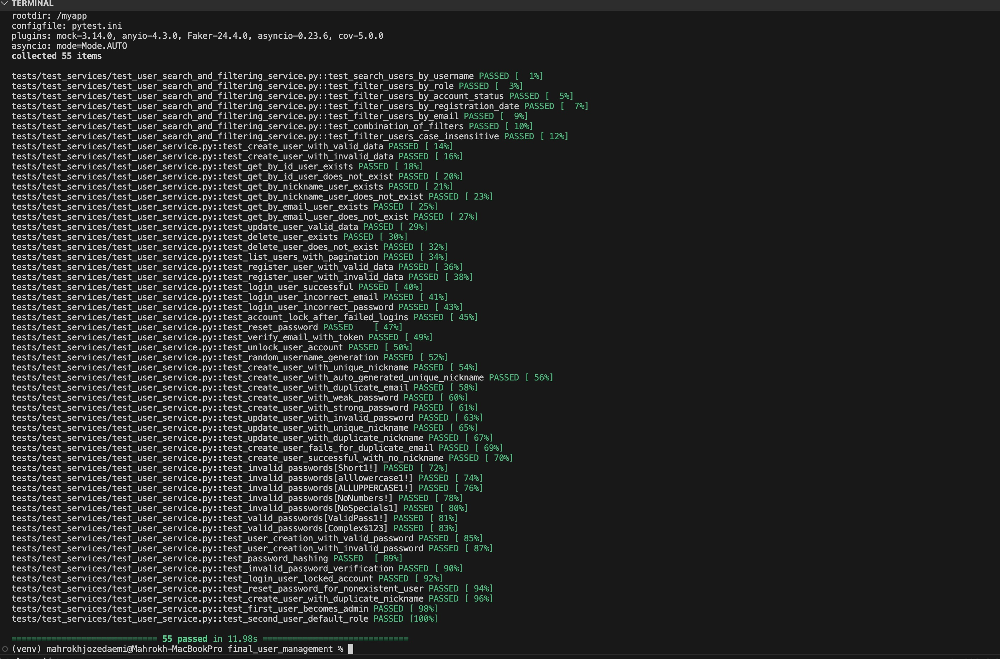


# ISSUE: User Bio Update Validation and Error Handling          

## Enhancement:           
This enhancement focuses on improving the validation and error handling mechanisms for the update_user_bio functionality in the user management system. It ensures that API responses are clear, consistent, and informative, making the feature more user-friendly and robust. Validation checks are introduced to verify the presence of the bio field and enforce a maximum length constraint of 500 characters. Additionally, error messages are standardized to provide actionable feedback to API consumers. Comprehensive tests are added to validate the functionality and edge cases, ensuring a reliable and seamless experience for both developers and users.          

## Key Features:          
1. Consistent Error Messages:            
- Error messages for missing or invalid bio fields are now clear, descriptive, and follow consistent capitalization rules.             
- For example: "Field required" and "Bio exceeds maximum length".       

2. Improved Validation Feedback:                
- The API now provides detailed error responses when validation fails, including information about constraints like maximum length.            

3. Comprehensive Test Coverage:                 
- Added and updated test cases to verify validation for missing or invalid bio fields, ensuring robustness and reliability.           

## Benefits:        
1. Improved API Usability:            
- Developers integrating with the API receive clearer, actionable feedback for invalid requests.             
- Error messages include specific details about validation rules, reducing debugging time.              
2. Enhanced User Experience:           
- Clients are less likely to encounter unclear or ambiguous error messages when updating user bios.              
3. Increased Reliability:              
- Comprehensive test coverage ensures that updates to the bio validation logic function as expected across various scenarios.          

## Expected Outcome         
- Clearer Error Responses: Error messages for validation failures are consistent and provide detailed feedback.           
- Seamless Integration: API clients can easily integrate and debug issues related to bio updates.            
- Higher Test Coverage: Robust test cases ensure reliable behavior and prevent regressions in future updates.          

## Files Updated for Implementing This Issue           
1. user_routes.py:           
- Updated the update_user_bio endpoint to include improved error messages and validation logic.           
2. user_schemas.py:            
- Enhanced validation rules for the UpdateBioRequest schema, ensuring clearer error feedback.           
3. user_service.py:          
- Added specific validation checks for the bio field within the update method, ensuring consistent handling across services.            
4. test_user_routes.py:               
- Revised test cases for the update_user_bio endpoint to cover:        
   - Missing bio field.                
   - bio field exceeding the maximum length.          
   - Valid and invalid scenarios for unauthorized requests.            
5. test_user_service.py:            
- Added test cases for service-level validation of the bio field.            
- Verified behavior for valid, missing, and excessively long bio values.      

## Pytest:        
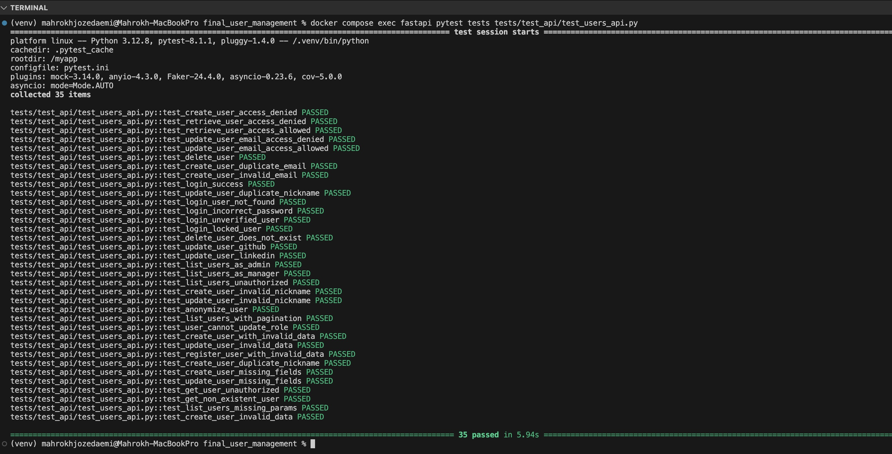

# ISSUE: Ensure Admin User Exists and Streamline /login Authentication Logic     

## Enhancement:       
The /login logic in user_routes.py was repeated multiple times, making the code redundant and harder to maintain. Additionally, authenticating as an admin user through Swagger (using the Authorize button) was not functioning as expected. This issue ensures the admin user (admin@example.com) is dynamically seeded into the database during migrations or tests, reducing code duplication and enabling secure and consistent authentication.           

## Benefits         
- Test Reliability: Ensures that tests for the /login endpoint consistently pass by dynamically creating the required admin user during test setup or database migrations.            
- Streamlined Logic: Removes redundancy in the /login logic, making the code more maintainable and easier to extend.           
- Secure API Testing: Allows successful admin authentication in Swagger, enhancing the ability to test and use the API securely.            
- Improved Accuracy: Reflects real-world scenarios for authenticating users via the /login endpoint, including robust password validation.           

## Expected Outcome         
- Swagger Authorization: Admin users should successfully authenticate using the Swagger Authorize button, improving the API testing experience.      
- Login Endpoint: The /login endpoint will securely and consistently handle authentication without redundant code.          
- Test Success: Tests for the /login endpoint, including test_login_success, will succeed and reliably validate endpoint behavior.           

## Files Updated for Implementing This Issue          
1. user_routes.py:           
- Refactored /login logic to eliminate redundancy while maintaining secure and consistent authentication.            

2. tests/test_routes/test_user_routes.py:        
- Updated the test_login_success test to ensure the admin user (admin@example.com) is fetched dynamically from the database and authenticated securely.             

3. alembic/versions/25d814bc83ed_initial_migration.py:            
- Modified the Alembic migration to seed the admin@example.com user during database migrations, ensuring it exists for both development and test environments.               
4. conftest.py:               
- Verified and maintained fixtures to support dynamic seeding of the admin user during test execution.

## Implementation Summary         
This update addresses challenges in the /login logic, improves the Swagger authentication experience, and ensures all tests for the endpoint pass by dynamically seeding the admin user during migrations or tests. This streamlining of logic reduces redundancy and enhances the maintainability of the codebase.         

## Pyest:       


# FEATURE: Search and Filtering Capabilities for User Management           
## Description:        
This feature allows administrators to search and filter users based on various criteria, such as username, email, role, account status (locked/unlocked), and registration date range. The system supports both basic search using query parameters and advanced search using dynamic JSON filters. Results are paginated for efficient navigation, and dynamic pagination links (next, prev, first, last) are provided to enhance usability.           

The implementation adheres to RESTful principles and offers clean, discoverable API responses. It also lays the groundwork for future enhancements like full-text search using ElasticSearch and user-friendly frontend integration.                         

## User Story:       
As an administrator, I want to be able to:           

1. Search for users by username, email, or role.          
2. Filter users based on account status or registration date range.        
3. Navigate through filtered results using pagination.       
4. Perform advanced searches with multiple dynamic filters for flexibility.       


## Viable Features:        
1. Search Functionality: Search for users using username, email, and role.         
2. Filtering Options: Filter users based on account status and registration date range.    
3. Advanced Search: Allow dynamic filter combinations with JSON input.        
4. Pagination: Integrate offset-based pagination with navigation links (next, prev, first, last).        
5. Clean API Responses: Return user-friendly and discoverable API responses.           

# 1. Routes (user_routes.py)      
## Title:               
Define the Search and Filtering Endpoint.           

## Description:        
Two endpoints are introduced in user_routes.py for user search and filtering:
1. /users-basic (GET): Supports simple searches using query parameters.           
2. /users-advanced (POST): Provides advanced search capabilities by accepting a JSON request body for multiple filters.              
These endpoints leverage schemas for input validation, dynamic filtering logic, and pagination utilities to return efficient and clean responses.        

## Expected outcome:          
1. Basic Search (/users-basic):         
- Accepts query parameters like username, email, role, is_locked, and pagination (skip, limit).    
- Returns paginated user data with dynamic pagination links.         

2. Advanced Search (/users-advanced):         
- Accepts a JSON body with filters: created_from, created_to, role, is_locked, etc.       
- Dynamically applies multiple filters to query users efficiently.                  
- Returns paginated results with metadata and the original filters for clarity.                

## Resolution Steps:        
## Step 1:Basic Search Endpoint       
- Added a GET endpoint for basic search.      
- Integrated UserService.search_and_filter_users for filtering logic.     
- Used UserSearchQueryRequest schema for query validation.       
- Included pagination with generate_pagination_links utility.        

```python
@router.get("/users-basic", response_model=UserListResponse, tags=["User Management Requires (Admin or Manager Roles)"])
async def basic_search_users(
    request: Request,
    query: UserSearchQueryRequest = Depends(),
    db: AsyncSession = Depends(get_db),
    current_user: dict = Depends(require_role(["ADMIN", "MANAGER"])),
):
    total_users, users = await UserService.search_and_filter_users(
        db,
        filters=query.dict(exclude_none=True),
        skip=query.skip,
        limit=query.limit,
    )
    pagination_links = generate_pagination_links(request, query.skip, query.limit, total_users)
    return UserListResponse(
        items=[UserResponse.model_validate(user) for user in users],
        total=total_users,
        page=(query.skip // query.limit) + 1,
        size=len(users),
        links=pagination_links,
        filters=query,
    )
```
## Step 2: Advanced Search Endpoint     
- Added a POST endpoint for advanced search.     
- Integrated UserService.advanced_search_users for flexible dynamic filtering.         
- Used UserSearchFilterRequest schema for JSON request validation.        

```python
@router.post("/users-advanced", response_model=UserListResponse, tags=["User Management Requires (Admin or Manager Roles)"])
async def advanced_search_users(
    request: Request,
    filters: UserSearchFilterRequest,
    db: AsyncSession = Depends(get_db),
    current_user: dict = Depends(require_role(["ADMIN", "MANAGER"])),
):
    total_users, users = await UserService.advanced_search_users(
        db,
        filters=filters.dict(exclude_none=True),
    )
    pagination_links = generate_pagination_links(request, filters.skip, filters.limit, total_users)
    return UserListResponse(
        items=[UserResponse.model_validate(user) for user in users],
        total=total_users,
        page=(filters.skip // filters.limit) + 1,
        size=len(users),
        links=pagination_links,
        filters=filters,
    )
```

# 2. Service Layer
## Title: Implement Dynamic Filtering and Pagination Logic      
## Description:     
The UserService handles all filtering and pagination logic. Both basic and advanced searches are dynamically implemented using SQLAlchemy. Filters are applied conditionally based on input values.      

## Expected Outcome          
1. Filters like username, email, role, is_locked, and registration date range are applied dynamically.      
2. Supports pagination using skip and limit parameters for efficient querying.      
3. Handles edge cases where filters are missing or invalid.                   

## Resolution Steps          
## Step1: Basic Filtering Logic    
- Used dynamic query-building for basic search criteria.      
```python
if filters.get("username"):
    query = query.where(User.nickname.ilike(f"%{filters['username']}%"))
if filters.get("email"):
    query = query.where(User.email.ilike(f"%{filters['email']}%"))
if filters.get("created_from"):
    query = query.where(User.created_at >= filters["created_from"])
if filters.get("created_to"):
    query = query.where(User.created_at <= filters["created_to"])
```
## Step2:Advanced Filtering Log      
- Added flexibility to apply filters dynamically from JSON inputs.    
```python
for field, value in filters.items():
    if field == "username" and value:
        query = query.where(User.nickname.ilike(f"%{value}%"))
    elif field == "created_from" and value:
        query = query.where(User.created_at >= value)
```

# 3. Schemas (user_schemas.py)          
## Title:Define Validation Schemas for User Search and Filtering        

## Description           
Introduced two schemas to validate inputs for basic and advanced search:      
1. UserSearchQueryRequest: For query parameters (GET).        
2. UserSearchFilterRequest: For JSON body filters (POST).           
These schemas ensure that inputs are correctly structured, validated, and documented.           

## Expected Outcome          
The schema should:           
1. Ensure that all query parameters adhere to the expected data types.       
2. Provide example values for API documentation purposes.          

## Resolution Steps            
- Defined the UserSearchParams model using Pydantic.              
- Included fields for username, email, role, account_status, and date range.               

Purpose: Define the models for query parameters and response structure.         

```python
class UserSearchQueryRequest(BaseModel):
    username: Optional[str]
    email: Optional[str]
    role: Optional[UserRole]
    is_locked: Optional[bool]
    skip: int = Field(0, ge=0)
    limit: int = Field(10, gt=0, le=100)

class UserSearchFilterRequest(BaseModel):
    username: Optional[str]
    email: Optional[str]
    role: Optional[UserRole]
    created_from: Optional[datetime]
    created_to: Optional[datetime]
    skip: int = Field(0, ge=0)
    limit: int = Field(10, gt=0, le=100)

```

# 4. Pagination Helper (utils/pagination.py)        
## Title
Generate Pagination Links.           

## Description           
A helper utility generates pagination links (next, prev, first, last) dynamically based on the current page, total users, and pagination parameters.                     

## Expected Outcome         
The helper function should:
1. Return next, prev, first, and last page links based on the current pagination state.                
2. Ensure compatibility with query parameters.          

## Resolution Steps          
- Implemented the generate_pagination_links function.             
- Calculated page links dynamically based on skip, limit, and total_items.       

Purpose: Generate pagination links for the API response.          

```python
from typing import Any, Dict
from urllib.parse import urlencode


def generate_pagination_links(
    request: Any, skip: int, limit: int, total_items: int
) -> Dict[str, str]:
    """
    Generate pagination links for API responses.
    """
    base_url = str(request.url).split("?")[0]
    query_params = dict(request.query_params)

    # Calculate the next page link
    if skip + limit < total_items:
        query_params["skip"] = skip + limit
        query_params["limit"] = limit
        next_link = f"{base_url}?{urlencode(query_params)}"
    else:
        next_link = None

    # Calculate the previous page link
    if skip - limit >= 0:
        query_params["skip"] = max(skip - limit, 0)
        query_params["limit"] = limit
        prev_link = f"{base_url}?{urlencode(query_params)}"
    else:
        prev_link = None

    # Calculate the first and last page links
    query_params["skip"] = 0
    first_link = f"{base_url}?{urlencode(query_params)}"

    last_page_skip = (total_items - 1) // limit * limit
    query_params["skip"] = last_page_skip
    last_link = f"{base_url}?{urlencode(query_params)}"

    return {
        "next": next_link,
        "prev": prev_link,
        "first": first_link,
        "last": last_link,
    }
```

# 5. Test for Pagination Helper            
## Title           
Validate Pagination Links.           

## Description           
This section tests the behavior of the pagination helper to ensure correct link generation.             

## Expected Outcome         
The test should validate:               
- Correctness of next, prev, first, and last links.            
- Edge cases like the first and last pages.             

## Resolution Steps               
- Created a test for generate_pagination_links with various scenarios.           
- Used a mocked Request object to simulate API requests.            

Purpose: Validate the behavior of the pagination helper.           

```python
import pytest
from starlette.datastructures import QueryParams, URL
from utils.pagination import generate_pagination_links


@pytest.mark.asyncio
async def test_generate_pagination_links():
    class MockRequest:
        def __init__(self, base_url):
            self.url = URL(base_url)
            self.query_params = QueryParams()

    request = MockRequest("http://localhost:8000/users")

    skip = 0
    limit = 10
    total_users = 45

    links = generate_pagination_links(request, skip, limit, total_users)

    assert links["next"] == "http://localhost:8000/users?skip=10&limit=10"
    assert links["prev"] is None
    assert links["first"] == "http://localhost:8000/users?skip=0&limit=10"
    assert links["last"] == "http://localhost:8000/users?skip=40&limit=10"
```

# Tests for User Search and Filtering Feature      
## Overview         
The user search and filtering functionality is tested extensively to ensure it meets the defined requirements and behaves as expected under various conditions. These tests validate the API endpoint, service layer, pagination, and filtering mechanisms. Below is a detailed explanation of each test and its purpose.           
# test_api/test_user_search_and_filtering.py         
# 1. test_search_users_api:        
- Purpose: To verify the /users endpoint correctly handles search requests with valid parameters.            
- Description: This test sends a GET request with specific filters like username, role, and account status to ensure the endpoint returns filtered users.       
- Expected Outcome:
  - Status code 200.        
  - Response includes an items list containing users with the correct fields like nickname and email.         
- Importance: Ensures the basic search functionality works and returns the expected user data for valid inputs.

# 2. test_empty_filters_api:     
- Purpose: To check that the /users endpoint works without any filters applied.        
- Description: Sends a request with no query parameters and expects all users to be returned.       
- Expected Outcome:      
  - Status code 200.        
  - Response includes all users in the system as a list under items.
total count matches the number of users in the database.        
- Importance: Validates that the endpoint correctly handles empty filters and provides all results.          

# 3. test_fetch_all_users:      
- Purpose: To test pagination with no filters by fetching the first set of users.          
- Description: Sends a GET request with pagination parameters (skip and limit) and validates the response structure.        
- Expected Outcome:       
  - Status code 200.        
  - Correct number of users returned based on limit.          
  - total users count is non-negative.       
- Importance: Ensures pagination works correctly and provides partial results as requested.       

# 4. test_search_users_pagination:      
- Purpose: To validate pagination behavior when fetching user results across multiple pages.       
- Description: Tests fetching users with different offsets (skip) and ensures results are paginated properly.          
- Expected Outcome:          
  - Status code 200.       
  - Response items match the requested limit.        
  - Second page contains the next set of results.         
- Importance: Ensures consistent and accurate pagination, a crucial feature for handling large datasets.            

# 5. test_advanced_search_users_with_all_filters:        
- Purpose: To verify the advanced search endpoint works when all filters are applied.          
- Description: Sends a POST request with filters like username, email, role, account status, and date range.         
- Expected Outcome:          
  - Status code 200.            
  - Returned users match all specified filters.         
  - The result is paginated.           
- Importance: Tests the robustness of the advanced search feature and its ability to handle multiple criteria simultaneously.         

# 6. test_advanced_search_users_with_date_range_no_results        
- Purpose: To verify the behavior when a date range filter returns no results.          
- Description: Sends a POST request with a date range that doesn’t match any users.         
- Expected Outcome:         
  - Status code 200.       
  - total count is 0.        
  - items list is empty.              
- Importance: Ensures the endpoint handles edge cases gracefully without errors.         

# 7. test_advanced_search_users_with_invalid_role     
- Purpose: To validate that invalid role inputs are handled properly.      
- Description: Sends a POST request with an invalid role value that does not match the system-defined roles.           
- Expected Outcome:         
  - Status code 422 (validation error).        
  - detail field in the response contains an appropriate validation error message.        
- Importance: Ensures data validation is strict, preventing incorrect inputs from breaking the system.       

# 8. test_advanced_search_users_with_partial_email       
- Purpose: To test partial email matching in the advanced search endpoint.        
- Description: Sends a request with a partial email string and verifies that matching users are returned.        
- Expected Outcome:        
  - Status code 200.       
  - Returned users' emails contain the partial string.        
- Importance: Verifies the flexibility of the search feature and ensures partial matches work correctly.          

# 9. test_advanced_search_users_pagination_exceeding_total       
- Purpose: To check pagination behavior when skip exceeds the total number of results.         
- Description: Sends a request with a high skip value to simulate an out-of-bounds scenario.           
- Expected Outcome:         
  - Status code 200.       
  - items list is empty.        
  - total count remains valid and non-negative.        
- Importance: Ensures that pagination handles edge cases properly without causing errors or crashes.              

# test_user_search_and_filtering_service.py      
## Description
This test suite ensures the robustness of user search and filtering functionalities in the UserService. It includes various scenarios such as filtering by username, email, role, and account status, as well as advanced features like case-insensitive searches, date range filters, and pagination. The suite validates that the search logic dynamically handles multiple filters, adheres to expected constraints, and returns accurate results, even in edge cases.         

# 1. test_search_users_by_username        
- Purpose: To verify filtering users by partial username works as expected.            
- Description: Tests the search_and_filter_users method by providing the first three characters of a user's username in a case-insensitive manner.
- Expected Outcome:               
  - At least one user is returned (total > 0).        
  - All returned users have nicknames containing the partial input.       
- Importance: Ensures that users can be searched flexibly by partial usernames, supporting case-insensitive searches.        

# 2. test_filter_users_by_role       
- Purpose: To validate filtering users by their role.        
- Description: Tests if users with a specific role (ADMIN) are returned correctly.          
- Expected Outcome:             
  - Total users returned are non-negative.        
  - All users in the result have the role ADMIN.         
- Importance: Confirms that role-based filtering works as expected, which is critical for role-based access management.         

# 3. test_filter_users_by_account_status         
- Purpose: To validate filtering users by their account status.          
- Description: Tests the is_locked filter to return only unlocked users (is_locked=False).            
- Expected Outcome:          
  - Total users returned are non-negative.          
  - All returned users have their is_locked status set to False.         
- Importance: Ensures that administrators can manage locked or unlocked accounts effectively.        

# 4. test_filter_users_by_email        
- Purpose: To validate filtering users by their email.          
- Description: Tests the system’s ability to match users based on their email address.            
- Expected Outcome:            
  - Users with the exact email match are returned.            
  - Importance: Ensures accurate search functionality when filtering by email, which is a key identifier for users.         

  # 5. test_combination_of_filters
- Purpose: To test the combination of multiple filters.          
- Description: Applies multiple filters like username, role, and account status simultaneously to validate combined filtering.           
- Expected Outcome:           
  - Users matching all specified filters are returned.           
- Importance: Validates that the system can handle complex queries with multiple conditions.           

# 6. test_filter_users_case_insensitive
- Purpose: To ensure filtering works in a case-insensitive manner for usernames and emails.          
- Description: Tests partial and case-insensitive matches for username and email filters.           
- Expected Outcome:         
  - Users are returned regardless of case differences in nickname and email.            
- Importance: Ensures usability and flexibility by supporting case-insensitive searches.         

# 7. test_advanced_search_users_with_no_filters          
- Purpose: To test advanced search when no filters are provided.         
- Description: Validates that the system returns all users with default pagination.             
- Expected Outcome:          
  - Total users match the count of all users in the system.         
  - Results respect the default pagination limit.          
- Importance: Ensures the system handles empty filter input gracefully and defaults to returning all users.         

# 8. test_advanced_search_users_with_username_filter         
- Purpose: To verify advanced search works with a partial username filter.
- Description: Filters users using a partial match on the username.       
- Expected Outcome:         
  - Users returned match the partial username filter.           
- Importance: Confirms flexibility in username-based searches within the advanced search         

# 9. test_advanced_search_users_with_email_filter        
- Purpose: To validate advanced search functionality with partial email filters.         
- Description: Filters users based on a partial email match.          
- Expected Outcome:            
  - Users returned have emails containing the specified partial string.        
- Importance: Ensures that partial matches for email work effectively.    

# 10. test_advanced_search_users_with_role_filter         
- Purpose: To test advanced search filtering users by role.         
- Description: Filters users with the AUTHENTICATED role.         
- Expected Outcome:         
  - All returned users have the role AUTHENTICATED.         
- Importance: Ensures the role filter is correctly applied in the advanced search.          

# 11. test_advanced_search_users_with_date_range_filter          
- Purpose: To validate filtering users based on a date range.         
- Description: Filters users created within the last 30 days using created_from and created_to filters.           
- Expected Outcome:          
  - Users' created_at timestamps fall within the specified range.        
- Importance: Critical for time-based filtering, such as identifying new user accounts or activity trends.         

# 12. test_advanced_search_users_with_pagination         
- Purpose: To test pagination functionality in the advanced search endpoint.         
- Description: Uses skip and limit filters to fetch paginated results.          
- Expected Outcome:       
  - Results respect the pagination parameters (skip=10, limit=10).       
  - Total count matches the total users in the database.           
- Importance: Ensures efficient navigation and result management for large datasets.        

# test_user_search_and_filtering_pagination.py       
## Description          
This test suite focuses on validating the pagination functionality for user search results. It ensures that the pagination logic, including the generation of dynamic navigation links (e.g., self, next, prev, first, last), works correctly in various scenarios. The tests cover both general pagination behavior and edge cases, such as when the total number of items is less than the limit or when the offset (skip) exceeds the total number of items.         

# 1. test_generate_pagination_links         
- Purpose: To validate that the generate_pagination_links function creates accurate pagination links.         
- Description:        
  - Simulates a request to the /users endpoint with skip=0, limit=10, and a total of 45 users.         
  - Verifies the correctness of links (self, first, last, and next) generated for the pagination state.         
  - Ensures that the prev link does not appear on the first page.         
- Expected Outcome:         
  - Correct links for self, first, last, and next are generated.         
  - The prev link is not generated for the first page.           
- Importance:Ensures smooth navigation through paginated results, improving usability and API consistency.              

# 2. test_pagination_edge_cases        
- Purpose: To test edge cases for pagination logic, such as small datasets and exact page boundaries.        
- Description:
  - Case 1: Total users are less than the pagination limit (limit=10, total_items=5).       
    - Verifies that no next or prev links are generated.         
  - Case 2: Total users are exactly a multiple of the limit (limit=10, total_items=20).         
    - Checks correctness of the last and next links.      
- Expected Outcome:
  - For small datasets: Only self and first links are generated.         
- For exact page boundaries: next and last links are generated correctly.          
- Importance:Confirms that the pagination logic handles edge cases gracefully, preventing unnecessary or invalid navigation links.        

# 3. test_pagination_boundary          
- Purpose: To test boundary cases for the /users API endpoint with pagination parameters.         
- Description:
  - Case 1: Skip value (skip=10000) exceeds the total number of users.            
    - Ensures no results are returned and the response is handled correctly.           
  - Case 2: Skip value is 0 and limit is set to 1.           
    - Verifies that only one user is returned and the total count remains accurate.            
- Expected Outcome:
  - For skip > total_items: API returns no results with total >= 0.       
  - For skip=0 and limit=1: API returns one result or fewer.        
- Importance:Ensures the API correctly handles pagination boundaries, preventing invalid queries or inconsistent responses.         

## Search and Filtering API Tests        
This image shows the test output for verifying search and filter functionality at the API level:       
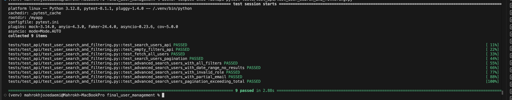      

## Search and Filtering Service Layer Tests        
This image highlights the test results for search and filtering functionality in the service layer:        
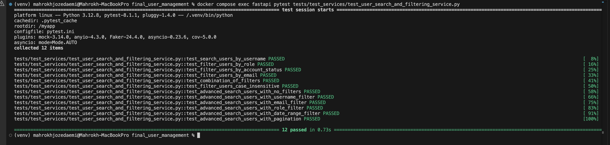       

## Pagination Tests           
This image demonstrates the output for the tests verifying pagination edge cases:         
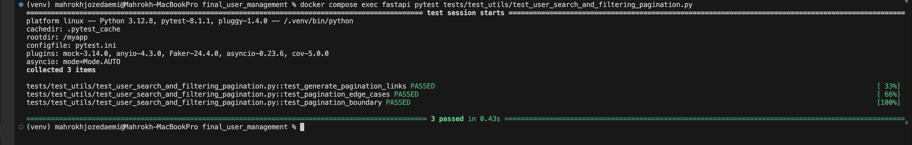       

# Test Coverage :       
This image shows the final test coverage of the entire project. It demonstrates the percentage of code covered by the implemented unit and integration tests.        
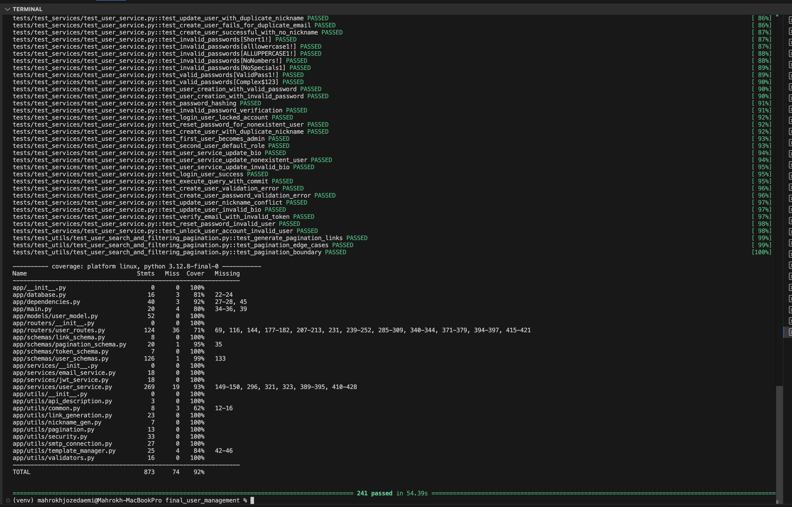      

# Pytest Results:             
This image displays the final Pytest output for the whole project. It confirms the successful execution of all tests, ensuring the functionality and reliability of the system.         
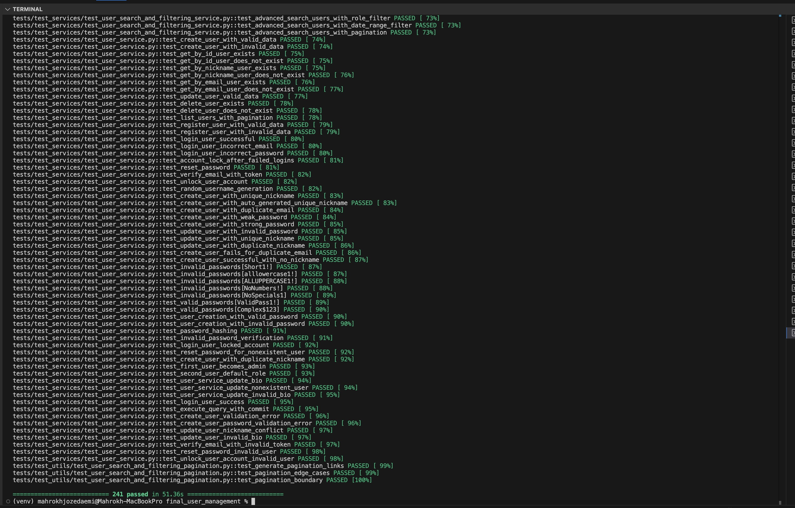      


           


## Why These Tests Are Important       
- Coverage: These tests collectively ensure that all aspects of user search, filtering, and pagination are thoroughly validated.      
- Error Handling: They confirm the API can gracefully handle invalid inputs and edge cases.            
- Reliability: Ensures the API behaves predictably under different conditions and filters.               
- Scalability: Validates pagination to handle large datasets effectively.           

## Results and Learnings          
From these tests, we verify:         
- The API filters users accurately based on the specified criteria.           
- Pagination works seamlessly, even at boundaries or edge cases.            
- The implementation adheres to the feature requirements, supporting all necessary filters and use cases.            


 


 


       


